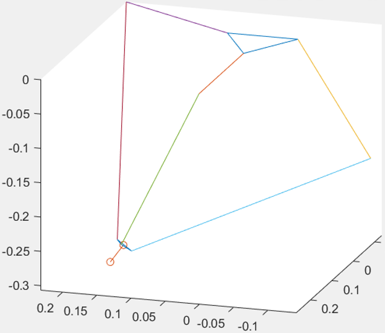

# DeltaHopper: Hopping in the three dimensions

### Introduction

In this project, we developed a jumping controller for CMU GOAT robotic leg. With our controller, the robot can jump in all directions at desired height and direction in the simulation (when orientation is constrained).

  

### Requirements

- Webots 2020b
- Visual Studio 2019
- Matalab 2020a or Matlab Runtime

### How to use

**Simulation**

First, clone this repository.

Then, open the Visual Studio solution `my_controller.sln` (in `DeltaHopperSim\controllers\my_controller`.) You will need to update the include path of Webots libraries.

Now you can start the simulation in `DeltaHopperSim\worlds`. Open the scene tree and set the controller of the robot to `extern`. Then, start the controller in Visual Studio.

**Forward Kinematics**

The forward kinematics and Jacobian is calculated with Matlab and then compiled into a C++ dynamic link library. The matlab code can be found in `FowardKinematicsMatlab`. 

  

### Reference
Kalouche, S. . (2017). GOAT: A legged robot with 3D agility and virtual compliance. 2017 IEEE/RSJ International Conference on Intelligent Robots and Systems (IROS). IEEE